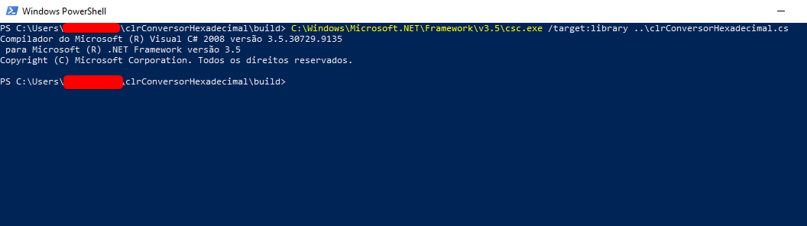
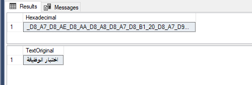

# clrConversorHexadecimal

## Conversor de String para Hexadecimal e de Hexadecimal para String

Este projeto é uma CLR (Common Language Runtime) - SQL Function, no qual geramos uma DLL e importamos a mesma no banco de dados SQL Server (2008 ou superior), sendo uma função na qual é possível converter strings para hexadecimal. 

Podemos usar por exemplo para converter caracteres arábes em hexadecimal, salvando no banco de dados apenas o valor em hexadecimal, na hora de retornar esses dados na aplicação, convertemos para uma string novamente e exibimos normalmente. 

Com o intuito de não se prender a IDEs, e não ser necessário possuir o Visual Studio instalado, disponibilizarei apenas o arquivo (.cs) principal, e através dele podemos gerar a DLL que será importada no banco de dados. 

Caso não queira realizar a compilação pode ser utilizada a DLL já compilada, disponível na pasta "Build" ou na área de Release. 

Após esse contexto geral, vamos lá, irei separar em dois temas, primeiro a compilação da DLL e depois como instalar ela no banco de dados e usar: 

### Pré-Requisitos para compilação da DLL

1. Ter o .Net Framework 3.5 instalado (Pode ser baixado atráves desse link oficial da [Microsoft](https://www.microsoft.com/pt-br/download/details.aspx?id=21))

#### Passo 1. 

Com o .Net Framework 3.5 instalado na máquina é necessário verificar o caminho no qual foi feita a instalação. Geralmente fica no caminho abaixo:

`C:\Windows\Microsoft.NET\Framework\v3.5`

#### Passo 2. 

Abra o PowerShell (se estiver no Windows) e entre na pasta "build" que está dentro da pasta do projeto (no qual fez o clone ou download).

Após estar na pasta "build" basta digitar o seguinte comando (o caminho tem que ser o caminho da sua instação) e apertar Enter: 

`C:\Windows\Microsoft.NET\Framework\v3.5\csc.exe /target:library ..\clrConversorHexadecimal.cs`



Dessa forma já será compilado a DDL dentro da pasta, no qual podemos usar para carregar no banco de dados, e ser disponibilizada como uma função para ser utilizada. 

Fonte: Para essa compilação, caso tenha mais dúvidas pode seguir o tutorial direto da Microsoft com maiores detalhes, [acesse aqui](https://docs.microsoft.com/pt-br/sql/relational-databases/clr-integration/database-objects/getting-started-with-clr-integration?view=sql-server-ver15). 

##

### Importar a DLL (CLR) no banco de dados e utilizar

Para conseguirmos utilizar/importar a DLL temos que seguir os seguintes passos:

#### Passo 1

Primeiramente temos que habilitar o CLR em nossa base de dados (geralmente por padrão essa configuração é desabilitada por questões de segurança), atráves do comando (Em todos os exemplos será utilizado o banco de dados de exemplo `dbfunction`):

```
USE dbfunction
GO
-- habilitando o CLR
sp_configure 'clr enabled', 1

GO
--RECONFIGURE
RECONFIGURE WITH OVERRIDE
GO
```

#### Passo 2

Com o CLR habilitado precisamos importar a DLL, e para isso a DLL deve estar em alguma passa que o Servidor tenha acesso. Com isso iremos digitar o seguinte comando:

```
USE dbfunction
go
-- Publishing Assembly
IF EXISTS(SELECT * FROM sys.assemblies WHERE name = 'clrConversorHexadecimal')
BEGIN
  IF OBJECT_ID('fnc_clr_conversor_hexadecimal') IS NOT NULL
    DROP FUNCTION fnc_clr_conversor_hexadecimal

  DROP ASSEMBLY clrConversorHexadecimal
END
GO
CREATE ASSEMBLY clrConversorHexadecimal FROM 'C:\Users\Administrator\Desktop\clr\clrConversorHexadecimal.dll' WITH PERMISSION_SET = SAFE
GO
```

Obs: Substitua o caminho de exemplo acima, para o caminho no qual o seu servidor tenha acesso a ler o arquivo. 


#### Passo 3

Após os passos acima, valide se a importação foi bem sucedida com o comando abaixo, você verá que ela fica como um Assembly no Banco de dados. 

```
USE dbfunction
GO
SELECT * FROM sys.assemblies
```

#### Passo 4 

Após importar a DLL ainda é necessário fazer a criação da função que vamos usar para acessar a DLL. Use o exemplo abaixo para criar a função:

```
USE dbfunction
GO
CREATE FUNCTION fnc_clr_conversor_hexadecimal
(
    @sTextConvert NVARCHAR(MAX),
    @sTypeConvert NVARCHAR(MAX),
    @sSeparator NVARCHAR(MAX)
)
RETURNS NVARCHAR(MAX)
AS
EXTERNAL NAME clrConversorHexadecimal.[UserDefinedFunctions].[clrConversorHexadecimal]
GO
```

Após os passos acima a função já está apta a ser utilizada. 


### Como utilizo a função? 

A função pode ser utilizada como uma função normal do banco de dados, a diferença é que você não possui acesso ao fonte dela, ou seja, se você abrir a função com o comando `sp_helptext` você verá que a função está "vazia". 

Veja como passar os dados para que a função processe, é necessário passar o texto a ser convertido, passar o tipo de conversão, onde temos duas opções "" e "", e por fim devemos passar qual o separador que aqueles hexadecimals terão, a função aceita os seguintes separadores `_`, `:`, `;`, `|` e `-`. 

#### Chamando a função para conversão em hexadecimal:

```
SELECT dbfunction.dbo.fnc_clr_conversor_hexadecimal(N'اختبار الوظيفة', 'convertHex', '_')
```

#### Chamando a função para conversão de hexadecimal para string novamente:

```
SELECT dbfunction.dbo.fnc_clr_conversor_hexadecimal(N'_D8_A7_D8_AE_D8_AA_D8_A8_D8_A7_D8_B1_20_D8_A7_D9_84_D9_88_D8_B8_D9_8A_D9_81_D8_A9', 'convertString', '_')
```

OBs: é necessário obrigatoriamente ter um separador, caso seja necessário você poderá customizar a função da forma que preferir mudando o separador, ou retirando a sua necessidade, porém lembre-se de ajustar os locais no qual validam 3 casos decimais, do contrário a função não terá o resultado esperado.

Ah!! Outro ponto importante é que o mesmo separador usado na conversão, é necessário ser passado na "desconversão", caso for passado outro separador, a função não terá o retorno esperado.

Veja exemplos de uso:

```
DECLARE @textHex NVARCHAR(4000), 
		@textSTR NVARCHAR(4000)

SELECT @textHex = dbfunction.dbo.fnc_clr_conversor_hexadecimal(N'اختبار الوظيفة', 'convertHex', '_')
SELECT @textHex AS Hexadecimal

SELECT @textSTR = dbfunction.dbo.fnc_clr_conversor_hexadecimal(@textHex, 'convertString', '_')
SELECT @textSTR AS TextOriginal
```

#### Retorno



#### Exemplo de utilização com tabelas (aqui no exemplo foi feito uma tabela inline só de demonstração)

```
SELECT result = dbfunction.dbo.fnc_clr_conversor_hexadecimal(test.field, 'convertHex', '_')
FROM   (   SELECT N'Arábe' AS field
           UNION ALL
           SELECT N'Ar_C3_A1_62_65'
           UNION ALL
           SELECT N'_41_72_C3_A1_62_65') test


SELECT result = dbfunction.dbo.fnc_clr_conversor_hexadecimal(test.field, 'convertString', '_')
FROM   (   SELECT N'Arábe' AS field
           UNION ALL
           SELECT N'Ar_C3_A1_62_65'
           UNION ALL
           SELECT N'_41_72_C3_A1_62_65') test
```

#### Retorno


Viu como é simples? Bora usar então, e aproveitar. 


OBs: Por segurança apenas importe DLL confiáveis ao seu banco de dados, e que você tenha acesso ao seu conteúdo.


